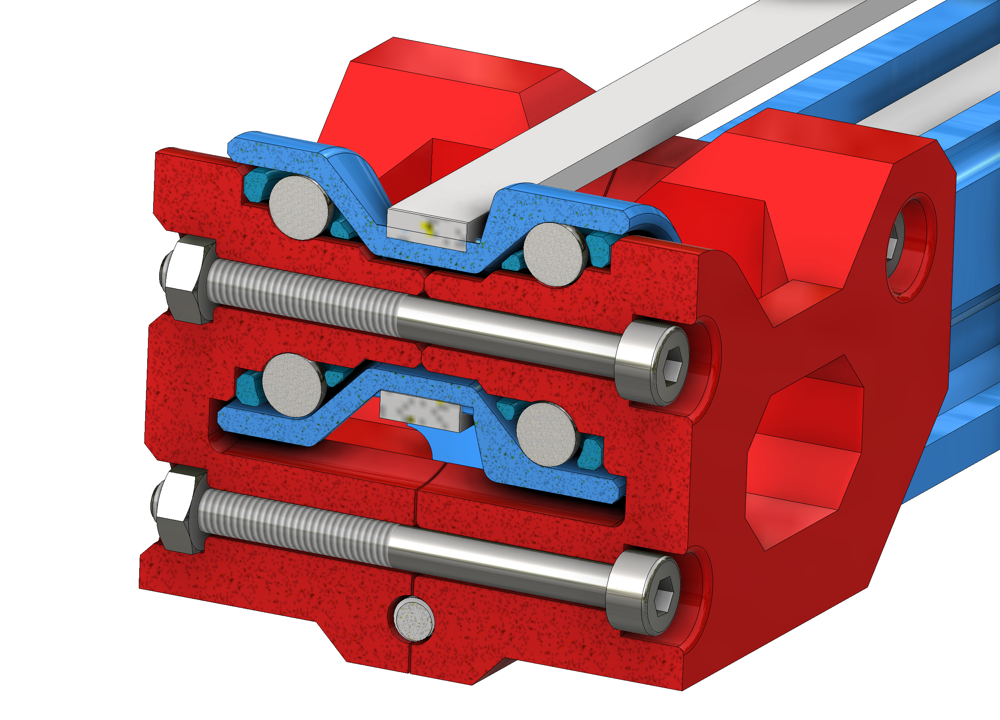

# Mostly printed Linear Actuator with PTFE bearing
Make a linear actuator with only a few purchased components and your 3D printer! Perfect for low load, low cycle applications. All you need is a 3D printer, stepper motor, bearing balls, fasteners, and PTFE bowden tubing.
 
### Features:
PTFE inserted linear bearing 
Rails can be bolted together for infinite travel lengths. 
Printable TPU GT2 belt file included, prints in vase mode. It is also compatible with a standard GT2 6mm wide belt. 
3D Printed idler pulley with integrated caged bearing balls. 
 

