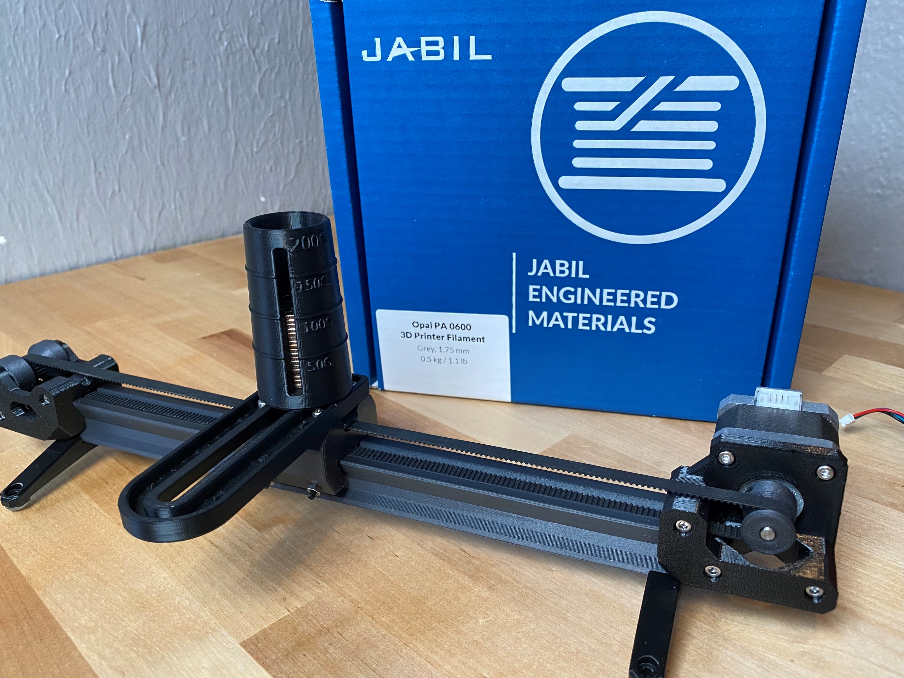

# Mostly printed Linear Dovetail Actuator 
Make a linear actuator with only a few purchased components and your 3D printer! Perfect for low load, low cycle applications. All you need is a 3D printer, a stepper motor, bearing balls, fasteners, and PTFE bowden tubing. 
### Features
This actuator is designed to use Jabil's Opal PA 0600 low friction nylon filament as bearing materail. 
Printable TPU GT2 belt file included, prints in vase mode. It is also compatible with a standard GT2 6mm wide belt. 
3D Printed idler pulley with integrated caged bearing balls. 
 
Note: Scale the parts that you print out of this filament up by 2%. 
 

