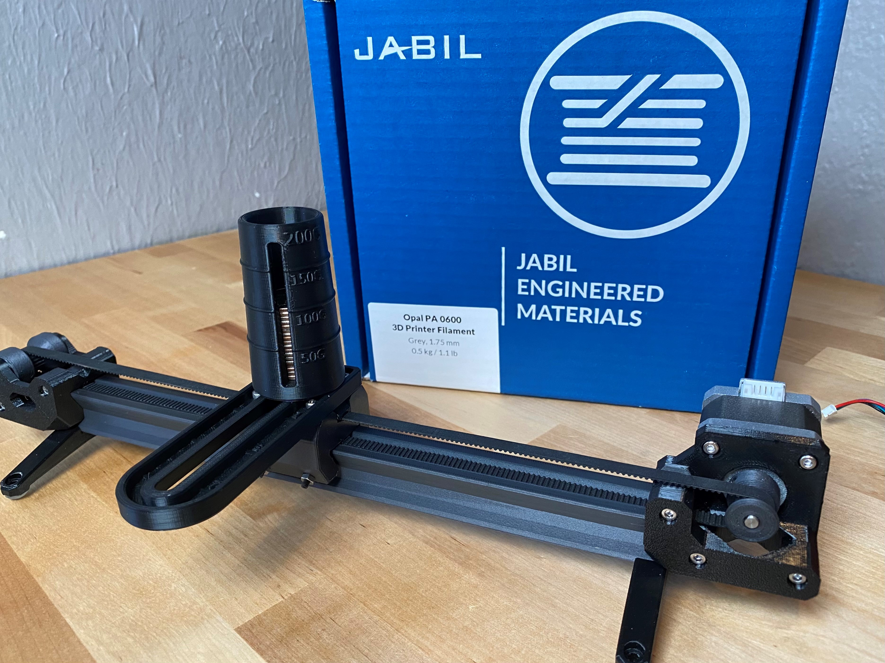

# Mostly Printed Linear Actuator Project

The goal of this project is to design a mostly printed bearing that can be used on a Mostly Printed 3D printer.

### Design Level #1
PTFE Inserted Bearing 
This version uses PTFE Tube otherwise known as Bowden tube as a bearing surface.  It worked good in initial testing but failed quickly after adding a load to the bearing.  
(obsoleted) 
 

### Design Level #2 
Dovetail Guided Actuator 
This version utilizes a nylon filament from Jabil with a low friction addative. 
(current model) 
 

